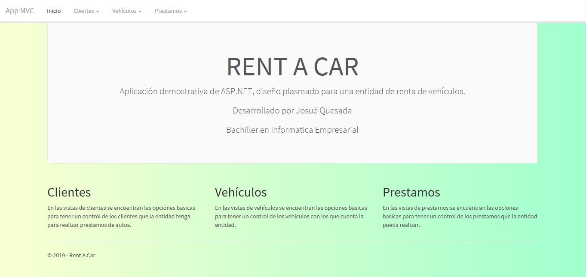
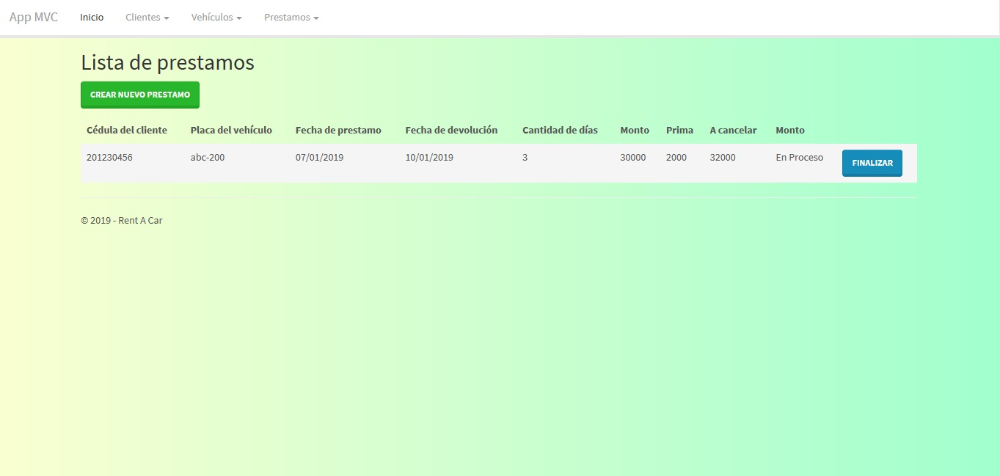
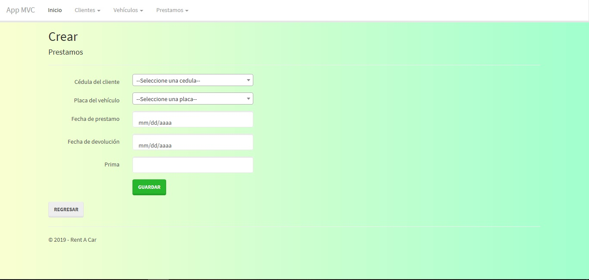
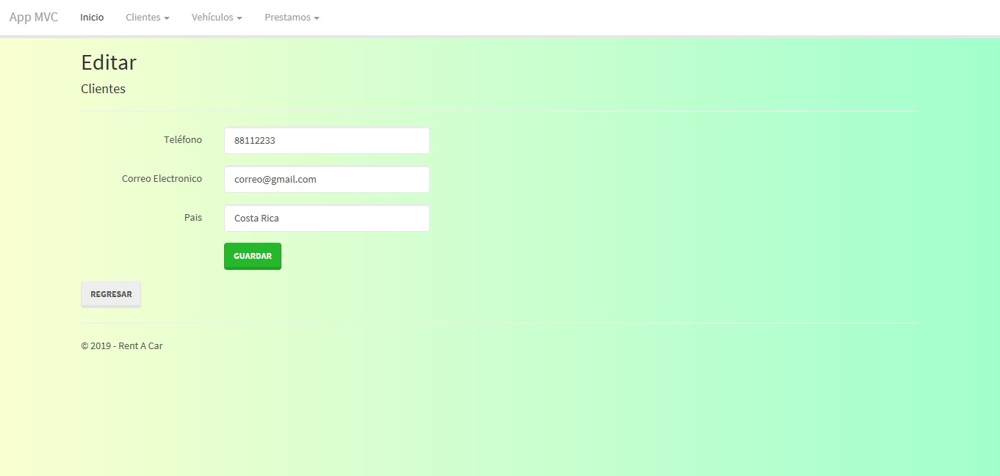
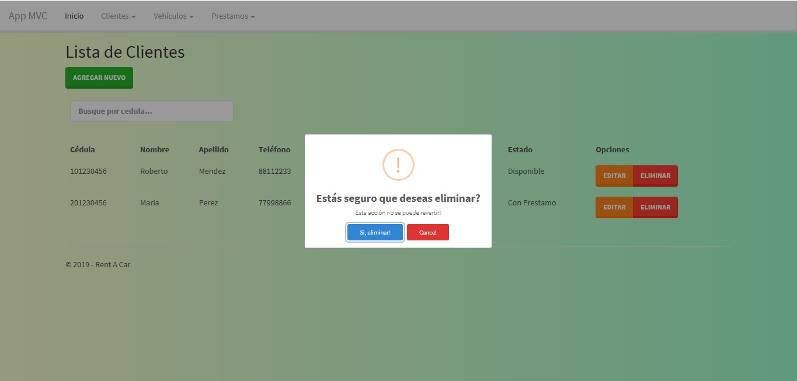

# Proyecto Demostrativo de ASP.NET
Este proyecto es una app diseñada hipoteticamente para una entidad de rentas de vehículos.

## Resumen
Una pequena app para demostrar conocimiento de ASP.NET MVC, en este proyecto
se diseña ciertas funciones con varios componentes, como AJAX, algunos componentes de jQuery y 
javascript. Tiene varias vistas de control y mantenimiento de clientes, vehículos y prestamos.
Incluye el script de base de datos para poder tener conexión logica con la aplicación.

## Autor 
Josue Quesada

## Interfaz

